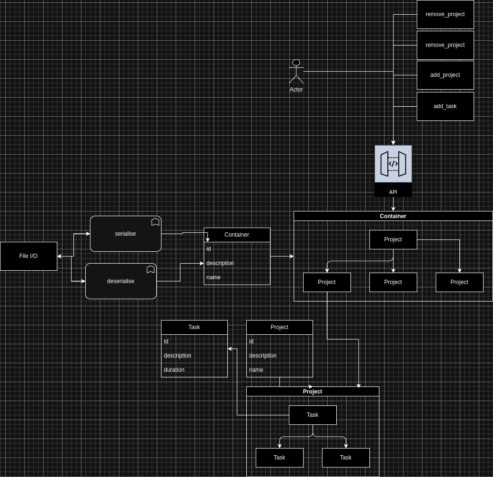

# Selfma: Scalable Task Management System

<div align="center">
    
</div>

Selfma is a high-performance, scalable task management system designed for efficiency and flexibility. It utilizes custom memory management, intelligent data loading, and a modular architecture to provide a robust solution for organizing projects and tasks across various interfaces.

## Core Features

- Project and task management with unique IDs and descriptions
- Custom memory allocation and management for optimal performance
- Efficient data structures (AVL trees, flexible arrays, stacks)
- Debug logging for memory operations and application flow

## Advanced Architecture

Selfma's architecture is designed for scalability and efficiency:

- **Core Module**: The foundation of the system, managing projects and tasks.
- **Threaded Container Pull**: Supports multiple users with dedicated file storage.
- **On-Demand Serialization**: Loads and deserializes data only when requested, optimizing memory usage.
- **Caching Mechanism**: Implements an LRU (Least Recently Used) cache for frequently accessed data.
- **Flexible Frontend Support**: Can be integrated with various user interfaces (UI/IMGUI/IMTUI/WEB/REST_API).
- **File-based Storage**: Uses file I/O for data persistence, offering a lightweight alternative to traditional databases.

## How It Works

1. User requests are received through the API layer.
2. The system loads the relevant user's data file.
3. Data is deserialized into a container object and cached in memory.
4. The core module processes the request and manages the data.
5. Upon completion, data is serialized back to the file system.
6. The system intelligently manages memory, loading only necessary data.

## Advantages

- **Scalability**: Efficiently handles multiple users and large datasets.
- **Performance**: On-demand data loading and caching minimize memory usage and improve response times.
- **Flexibility**: The core module can be easily integrated with various front-end solutions.
- **Lightweight**: File-based storage eliminates the need for a separate database system.

... (rest of the README content)

- Project management with unique IDs and descriptions
- Task management within projects, including task descriptions and durations
- Custom memory allocation and management
- Efficient data structures (AVL trees, flexible arrays, stacks)
- Debug logging for memory operations and application flow

## Project Structure

The project consists of several key components:

- `Container`: Manages multiple projects
- `Project`: Represents individual projects and manages tasks within them
- `Task`: Represents individual tasks with descriptions and durations
- Custom memory management (`qwistys_alloc`, `qwistys_flexa`, `qwistys_stack`)
- AVL tree implementation for efficient data storage and retrieval

## Building the Project

The project uses CMake for building. To build the project:

1. Ensure you have CMake clang ninja installed
2. Clone the repository
``` bash 
git clone git@github.com:QwistyS/selfma.git
```
3. Navigate to the project directory
```bash 
cd selfma
```
4. Create a build directory
```bash 
mkdir build && cd build
```
5. Run CMake 
```bash 
cmake .. -DCMAKE_BUILD_TYPE=Debug -DCMAKE_C_COMPILER=clang -DCMAKE_CXX_COMPILER=clang++ -G Ninja
```
6. Build the project
```bash
cmake --build . --targe all -j$(npro)
```

## Usage

The main application demonstrates the usage of the Selfma task management system:

1. Creates a `Container` to manage projects
2. Adds two projects: "Ramen" and "Selfma"
3. Adds multiple tasks to the "Ramen" project with various durations
4. Prints the project and task information
5. Cleans up resources and prints memory statistics

## Memory Management

Selfma uses custom memory management functions:

- `qwistys_alloc`: Custom memory allocation
- `qwistys_free`: Custom memory deallocation
- `qwistys_print_memory_stats`: Prints memory usage statistics

## Dependencies

- C++17 compatible compiler
- CMake (version 3.x or higher)
- Custom libraries: 
  - imtui (for potential GUI features)
  - Unity (for testing)

## Testing

The project includes test files for the `Container` and `Project` classes. To run the tests, build the project and execute the test binaries generated in the build directory.

## Contributing

Contributions to Selfma are welcome! Please feel free to submit pull requests, create issues or suggest improvements.

## License

[Maybe later]

## Author

[Qwistys]
